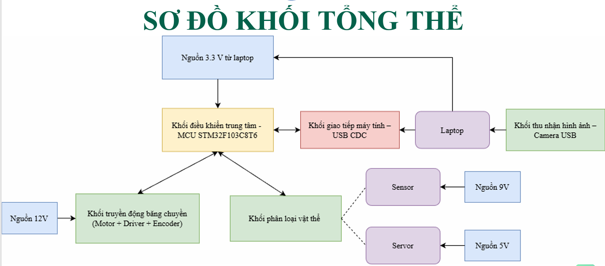
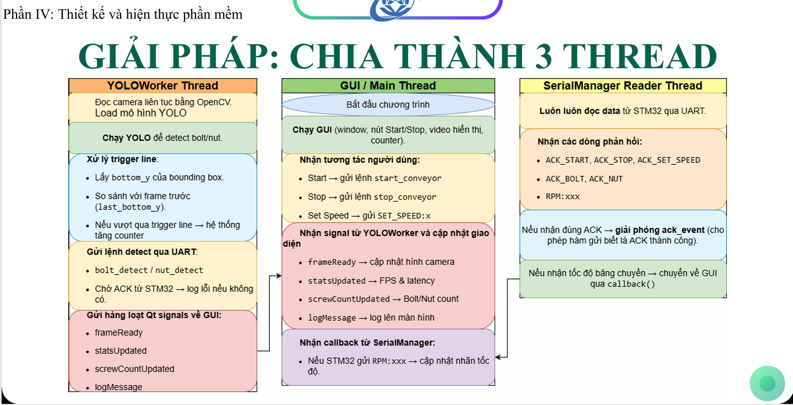
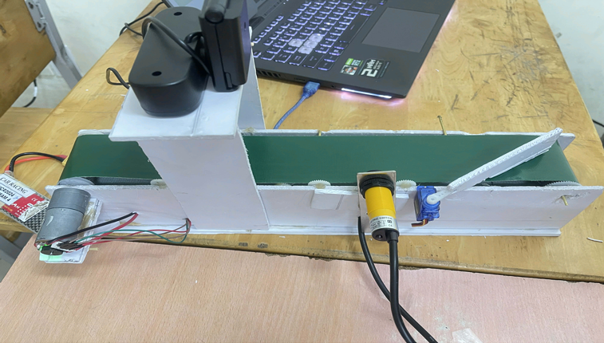
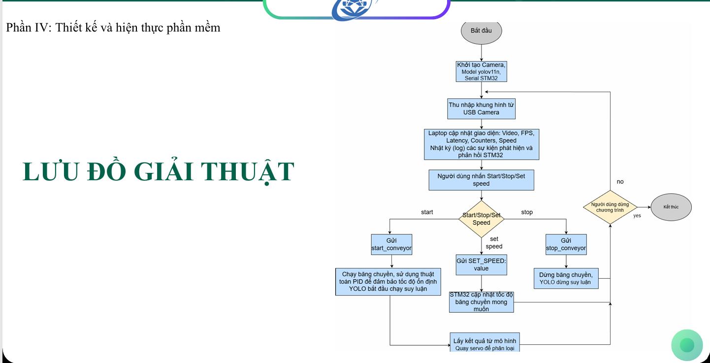
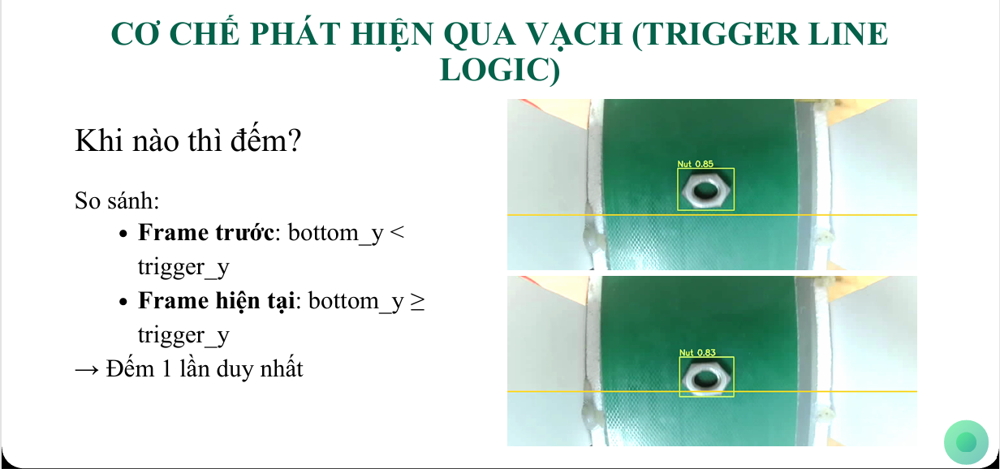
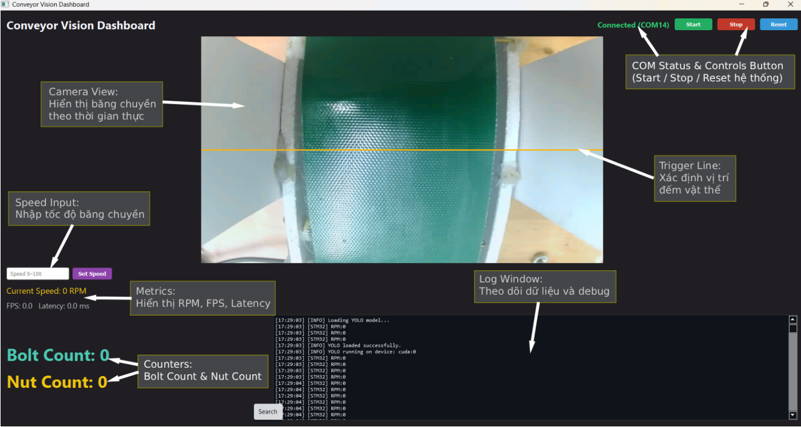

# 🔩 Bolt/Nut Sorting Conveyor System
> Real-time object detection and classification using YOLO v11n + STM32


---

## 📋 Table of Contents
- [Overview](#overview)
- [System Architecture](#system-architecture)
- [Hardware](#hardware)
- [Software](#software)
- [Results](#results)
- [Limitations](#limitations)
- [Future Work](#future-work)
- [Team](#team)

---

## 📌 Overview

A fully integrated conveyor belt system that classifies **bolts** and **nuts** in real time using computer vision (YOLO v11n) and automatic servo-based sorting controlled by STM32.

System Demo Video: https://drive.google.com/file/d/1v_gmj9hhoSi-2w5wkao2kqqGc-dJ_Ip0/view?usp=sharing

| Feature | Detail |
|---|---|
| Detection Model | YOLO v11n |
| Microcontroller | STM32F103C8T6 |
| Camera | USB 1080p Webcam |
| Communication | UART with ACK Validation |
| Classes | Bolt, Nut |
| Dataset Size | 837 images |

---

## 🏗️ System Architecture

### Block Diagram



### Software Architecture — 3-Thread Design



| Thread | Responsibility |
|---|---|
| **YOLOWorker** | Read camera, run YOLO inference, trigger line logic, send UART command |
| **GUI / Main** | Display video, handle user input (Start/Stop/Speed), update counters |
| **SerialManager** | Read STM32 ACK responses, sync hardware state |

---

## 🔧 Hardware

### Components



| Component | Specification |
|---|---|
| MCU | STM32F103C8T6 — ARM Cortex-M3 @ 72MHz |
| Motor | DC JGA25-370 12V with gearbox |
| Motor Driver | L298N |
| Servo | SG90, PWM 50Hz, 0.5–2.5ms pulse |
| Sensor | E3F-DS10C4 NPN, 3–10cm range, 6–36VDC |
| Camera | USB 1080p, 30 FPS, 70–110° FOV |
| GPU (PC) | RTX 3050Ti (YOLO inference) |

### Wiring Diagram


<!-- 🖼️ INSERT: Schematic or wiring diagram -->

---

## 💻 Software

### Algorithm Flow




### Trigger Line Logic

The system uses a **virtual trigger line** to count each object exactly once, avoiding duplicate counting across multiple frames.




```
Frame N:   bottom_y < trigger_y  →  object above line
Frame N+1: bottom_y ≥ trigger_y  →  COUNT (once only)
```

### PID Speed Control

STM32 runs a PID loop every **20ms** to maintain stable conveyor speed:

```
Setpoint (RPM) → Error → [Kp | Ki | Kd] → PWM → Motor → Encoder Feedback
```

### UART ACK Protocol

| Command | STM32 Response | Meaning |
|---|---|---|
| `start_conveyor` | `ACK_START` | Conveyor started |
| `stop_conveyor` | `ACK_STOP` | Conveyor stopped |
| `SET_SPEED:50` | `ACK_SET_SPEED` | Speed updated |
| `bolt_detect` | `ACK_BOLT` | Bolt detected & logged |
| `nut_detect` | `ACK_NUT` | Nut detected & logged |

### GUI Dashboard


<!-- 🖼️ INSERT: GUI screenshot (from slide page 52) -->

---

## 📊 Results

### Dataset Split

| Split | Count | Ratio |
|---|---|---|
| Train | 667 | 80% |
| Validation | 166 | 10% |
| Test | 166 | 10% |

### Model Performance

| Metric | Value |
|---|---|
| Precision | 0.9503 |
| Recall | 0.9342 |
| mAP@0.5 | 0.9668 |
| mAP@0.5:0.95 | 0.7133 |

### Detection Demo


<!-- 🖼️ INSERT: YOLO detection result on conveyor belt -->

---

## ⚠️ Limitations

1. Servo hold time introduces slight classification delay
2. Mechanical frame is not fully optimized
3. No object tracking algorithm (duplicate risk at high speed)
4. Only supports 2 object classes (bolt / nut)
5. No IoT integration or long-term data logging

---

## 🚀 Future Work

- [ ] Optimize servo mechanism and reduce hold time
- [ ] Integrate object tracking (ByteTrack / SORT / DeepSORT)
- [ ] Expand to multi-class classification
- [ ] Add IoT dashboard for remote monitoring
- [ ] Redesign mechanical frame for higher throughput

---

## 🏫 Affiliation

**University of Information Technology (UIT)**  
Faculty of Computer Engineering  
Group: Yo6 | Supervisor: Đoàn Duy

---

> *Built with YOLO v11n · STM32 · Python · OpenCV · PyQt*
